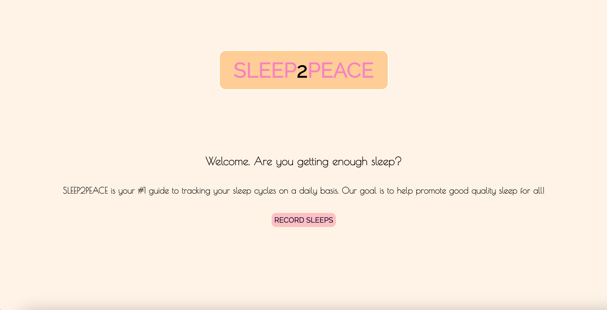
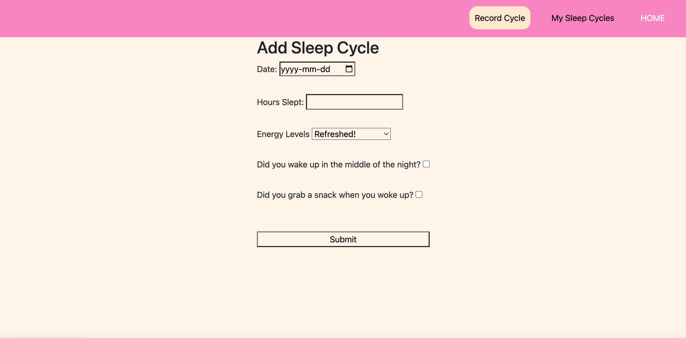
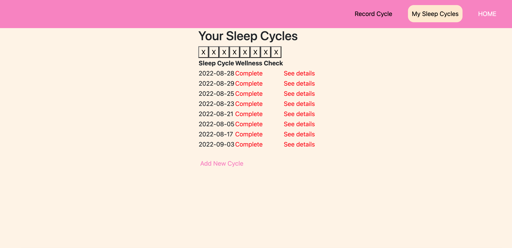
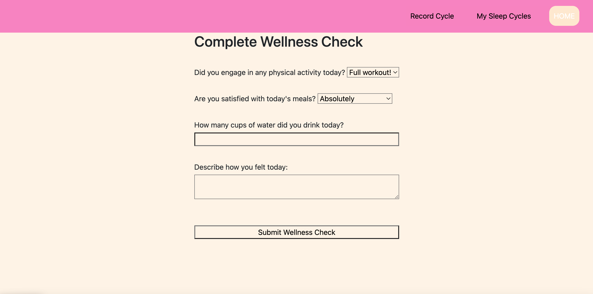
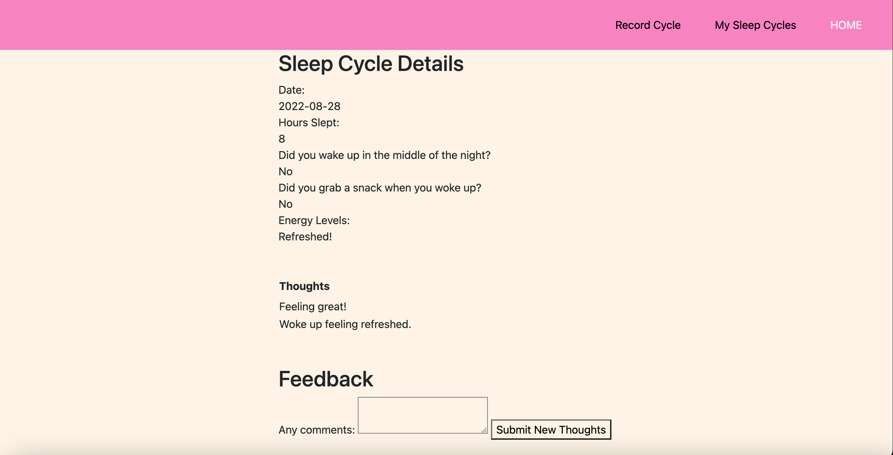

# Sleep2Peace

Sleep2Peace is a sleep-tracking web application that allows users to record sleep cycles on a daily basis.

</img>

### How it works:

1. On the 'HOME' page, click the "Record Sleeps" button, to navigate to the "Add Sleep Cycle" page. 

</img>

2. Once a sleep cycle is added, the app will redirect you to your "My Sleep Cycles" page, where you will be prompted to complete a "Wellness Check" form for the sleep cycle you just added. Each form will ask you questions related to the quality of your sleep.

</img>

</img>

3. You will also have the option to give personal feedback on each of your sleep cycles, as a way to keep yourself accountable on maintaining good quality sleeps.

</img>

## Technologies Used

- HTML
- CSS
- Javascript
- Node.js
- Express
- MongoDB
- Mongoose

## Getting Started

Click here to render the app on Heroku:

https://sleep2peace.herokuapp.com/

The following is a link to the Trello board containing the project's planning:

https://trello.com/invite/b/KQUKdVgU/885eedfb66239574e81a3a583effc4c8/sleep2peace

## Next Steps?

For the future, more styling, images, and soothing background sounds (nature sounds) will be added to bring better engagement for users while on the app.

