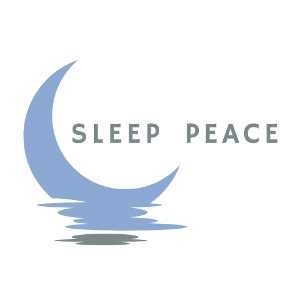
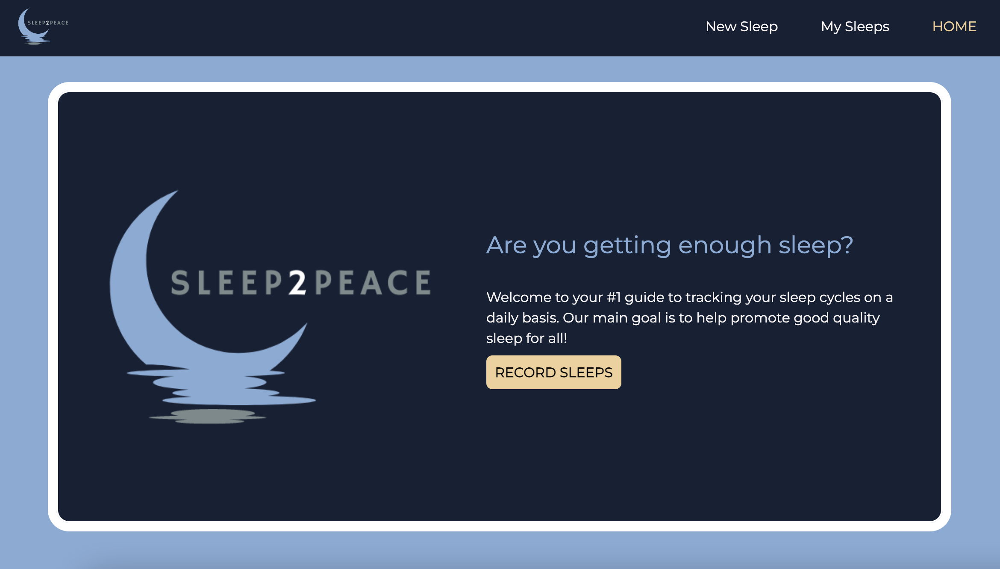

# Sleep2Peace

*Sleep2Peace* is an **interactive, sleep-tracking web application** that allows users to record their sleep cycles on a daily basis.

## Technologies Used

- JavaScript
- Node.js
- Express
- MongoDB
- Mongoose
- HTML
- CSS

## Getting Started

Click here to render the app on Heroku:

[Go To Sleep2Peace](https://sleep2peace.herokuapp.com/)

The following is a link to the Trello board containing the project's planning:

https://trello.com/invite/b/KQUKdVgU/885eedfb66239574e81a3a583effc4c8/sleep2peace

